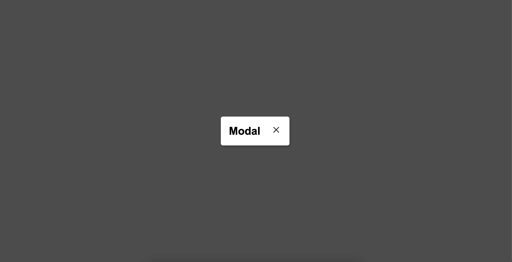
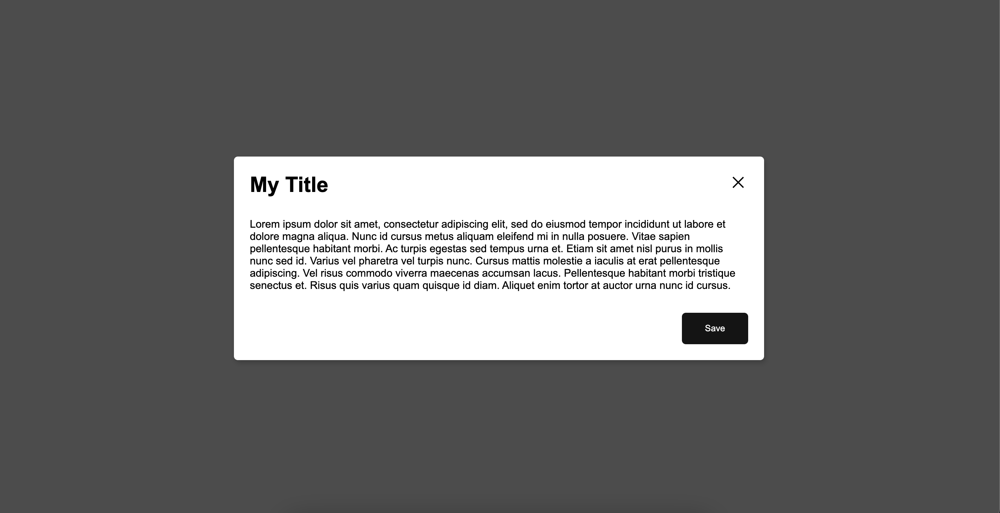

[](https://forthebadge.com)[](https://forthebadge.com)[](https://forthebadge.com)

# modal-rjs

modal-rjs is a React Modal dialog plugin.

## Installation

With [npm](https://www.npmjs.com) package manager

```bash
npm install modal-rjs
```

## Usage

### Basic



```javascript
import { Modal } from modal-rjs

// in your component
const YourComponent = () => {
	const [isOpen, setIsOpen] = useState(false)

    const handleClick() => {
        setIsOpen(true)
    }
    // basic modal
    return (
        <>
            <button onClick={handleClick}>Open Modal<button>
            <Modal
                isOpen
                setIsOpen
            />
        </>
    )
}
```

Note that `isOpen` and `setIsOpen` are necessary to toggle the modal.

### Adding your content



```javascript
import { Modal } from modal-rjs

// Custom title, body and footer

// in your component
const YourComponent = () => {
	const [isOpen, setIsOpen] = useState(false)

    const handleClick() => {
        setIsOpen(true)
    }

    const ModalContent = () => {
        return (
            <div>
                Lorem ipsum dolor sit amet, consectetur adipiscing elit, sed do eiusmod
                tempor incididunt ut labore et dolore magna aliqua. Nunc id cursus metus
                aliquam eleifend mi in nulla posuere. Vitae sapien pellentesque habitant
                morbi. Ac turpis egestas sed tempus urna et. Etiam sit amet nisl purus
                in mollis nunc sed id. Varius vel pharetra vel turpis nunc. Cursus
                mattis molestie a iaculis at erat pellentesque adipiscing. Vel risus
                commodo viverra maecenas accumsan lacus. Pellentesque habitant morbi
                tristique senectus et. Risus quis varius quam quisque id diam. Aliquet
                enim tortor at auctor urna nunc id cursus.
            </div>
        )
    }

    const ModalFooter = () => {
        return <Button label="Save"></Button>
    }

    return (
        <>
            <button onClick={handleClick}>Open Modal<button>
            <Modal
                isOpen={isOpen}
                setIsOpen={setIsOpen}
                title="My Title"
                bodyContent={<ModalContent />}
                footerContent={<ModalFooter/>}
            />
        </>
    )
}
```

### Advanced

The modal component accepts multiple parameters for further customization.

```javascript
isOpen, //* required set modal state
setIsOpen, //* required toggle modal state
className = "modal", //set a className to the modal elemen (Default is "modal")
id, //set an id to the modal element
testId, //set a test id to the modal element
overlayClassName = "overlay", //set a className to the overlay element (Default is "overlay")
headerClassName = "modal-header", //set a className to the header element (Default is "modal-header")
title = "Modal", //set a custom title (Default is "Modal")
titleClassName = "modal-title", //set a className to the title element (Default is "modal-title")
bodyContent = "", //set a body element, must be a node, can be plain HTML, a function returning HTML or a React component (Default is an empty string "")
bodyClassName = "modal-body", //set a className to the body element (Default is "modal-body")
footerContent, //set a footer element, must be a node, can be plain HTML, a function returning HTML or a React component (Default is an empty string "")
footerClassName = "modal-footer", //set a className to the footer element (Default is "modal-footer")
transition = 400, //set a transition duration to the appearance of the modal (Default is 400ms)
aria = {
    labelledby: "heading",
    describedby: "full_description",
}, //set aria elements to the modal (these are the default)
role = "dialog" //set a role to the modal (Default is "dialog")
closeColor = "black" //set the color of the close icon (You con only choose between "black" and "white" Default is "black")
```

Note that you can use your own CSS classes to handle styling. But be aware that by doing so, you will override all of the element's default styles.

## Contributing

You can check the repo [https://github.com/yanndarwish/modal-rjs](https://github.com/yanndarwish/modal-rjs).
Pull requests are welcome. For major changes, please open an issue first
to discuss what you would like to change.

Please make sure to update tests as appropriate.

## License

[MIT](https://choosealicense.com/licenses/mit/)
